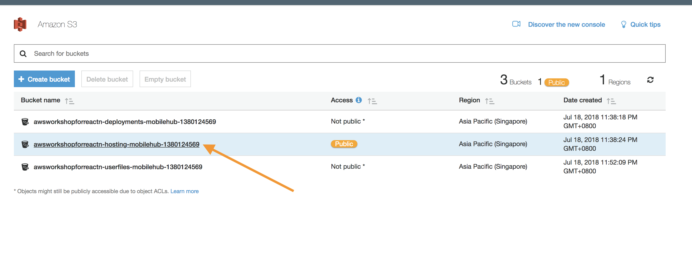
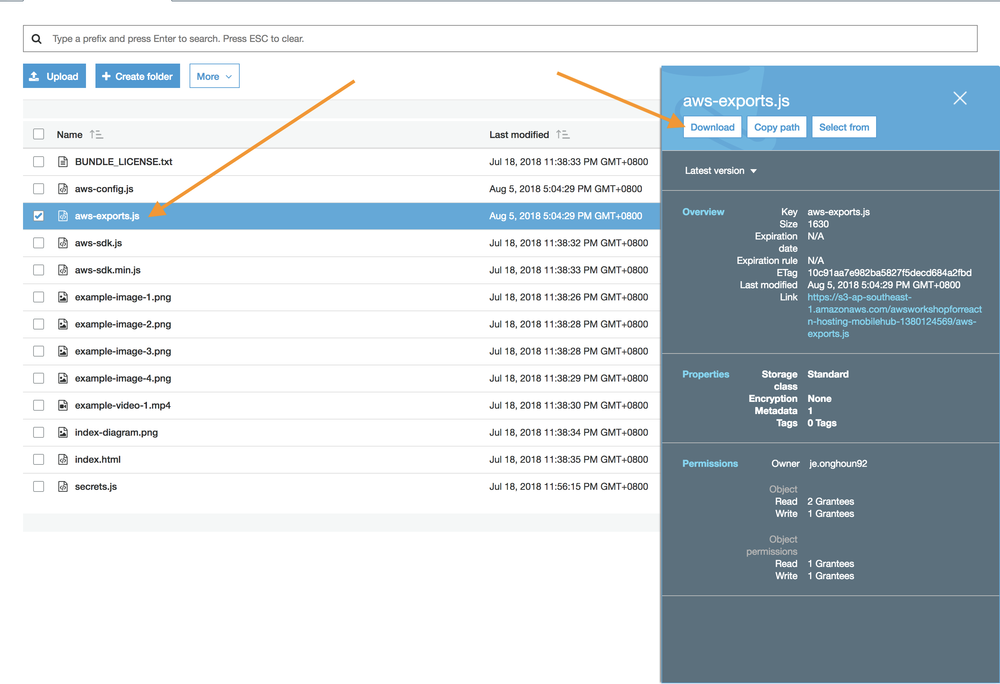
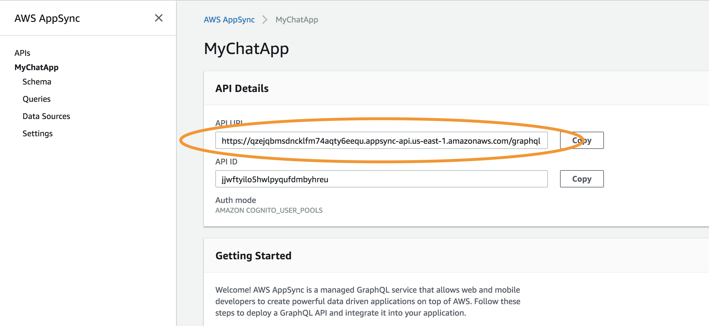
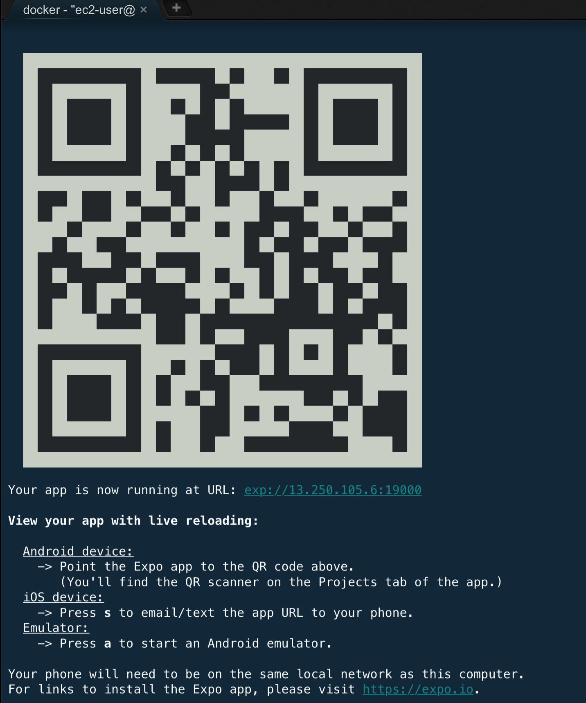

# React Native App with AWS Mobile Hub & AppSync

## Prerequisite

[Setup Cloud9](../setup/)

[Setup Mobile Hub](../mobilehub/)

[Setup AppSync](../appsync/)

## Table of Content

* [Getting AWS Credentials for our React Native app](#getting-aws-credentials-for-our-react-native-app)
* [Setup & Run The React Native App](#setup--run-the-react-native-app)
* [Run your App in Expo](#run-your-app-in-expo)
* [Bonus Lab](#bonus-lab)

## Getting AWS Credentials for our React Native app

Before you work on your React Native app, you will need the AWS credentials and you are able to get them in 2 ways:

A. Use `awsmobile cli`

B. Go to **S3 buckets** with your hosted files from AWS Mobile Hub

### A. Using awsmobile CLI to get AWS Credentials

In your previous [Setup Mobile Hub](../mobilehub/) via the AWS Mobile CLI, you can find your `aws-exports.js` at `awsmobilejs/#current-backend-info` folder.

### B. Using S3 to get AWS Credentials

Go to **Amazon S3** and find the S3 buckets that are created via **AWS Mobile Hub**.



Download the `aws-export.js` from S3



## Setup & Run The React Native App

Open a **new AWS Cloud9 Terminal**, Unzip the folder under ```~/environment/rn``` directory. The following 3 commands will download our React Native source code and unzip into the ```/code``` directory of our React-Native docker environment.

```
##Execute these in AWS Cloud9 Terminal, not the docker container

cd /home/ec2-user/environment/rn

wget http://bit.ly/aws-rn-appsync-cloud9 -O aws-rn-appsync-cloud9.zip

unzip -o aws-rn-appsync-cloud9.zip                   
```
Using AWS Cloud9 IDE, append these AppSync parameters to the `const awsmobile` in the `aws-exports.js` configuration file. Follow the below steps to retrieve your AppSync details.

```
'aws_appsync_graphqlEndpoint': 'https://xxx.appsync-api.ap-southeast-1.amazonaws.com/graphql',
'aws_appsync_region': 'ap-southeast-1',
'aws_appsync_authenticationType': 'AMAZON_COGNITO_USER_POOLS',
```

To get your Appsync graphql endpoint:



Make sure you are **inside React Native Docker** environment, you can now run the following command:
```
cd /code && yarn
yarn start
```

**Note**: if your `yarn` is **outdated**, please enter the following command to upgrade `yarn`:
```
curl -o- -L https://yarnpkg.com/install.sh | bash
```

**Note** if you see the following **no space left** error, please restart your Cloud9 instance.
```
Error: ENOSPC: no space left on device, write
error Could not write file "/code/yarn-error.log": "ENOSPC: no space left on device, write"
error An unexpected error occurred: "Command failed.
Exit code: 1
```

## Run your App in Expo

Once you have successfully ran `yarn start` without any errors, you should see the following screen on the Docker terminal.



Follow following instructions to get this application to work on your phone.

**iPhone users** On your safari, follow the steps. (The QR code does not work)
```
1. Open a new tab on your safari
2. In the URL/search bar, enter the url in the format of exp://<ip adderss> from your Docker terminal.
3. For our case, it was exp://13.250.105.6:19000
```

**Android users** Open your camera app, follow the steps
```
1. Point your camera at the QR code that appears on your Docker terminal
```

**Note**: if the app does not load properly in Expo, shake your phone and reload the app.

## Bonus Lab
You will noticed that the ``UserTable`` is empty. Let's add some React Native code to push the User Info (ie: Email address, Cognito sub and userId) that we get from Cognito Session into the ``UserTable``. Additionally, let's create a new field, ``dietary_requirement`` for each user item. You will need to implement a ``Save`` button component for this.
