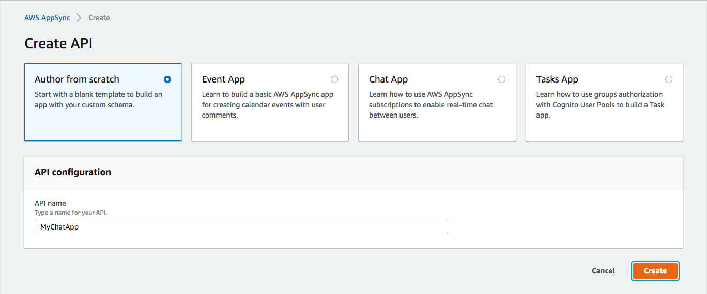
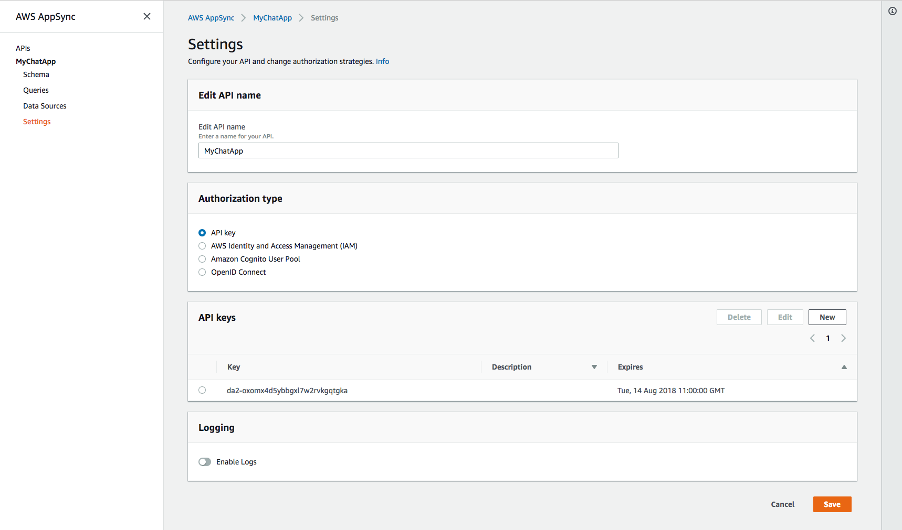
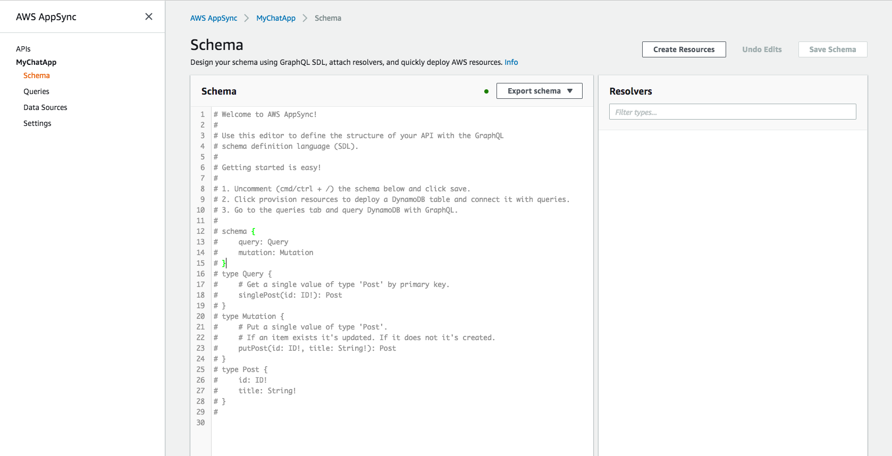
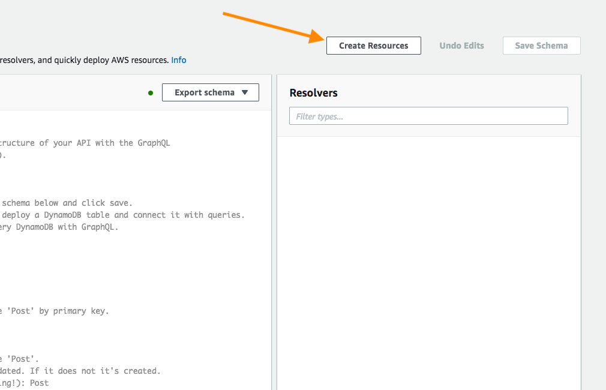
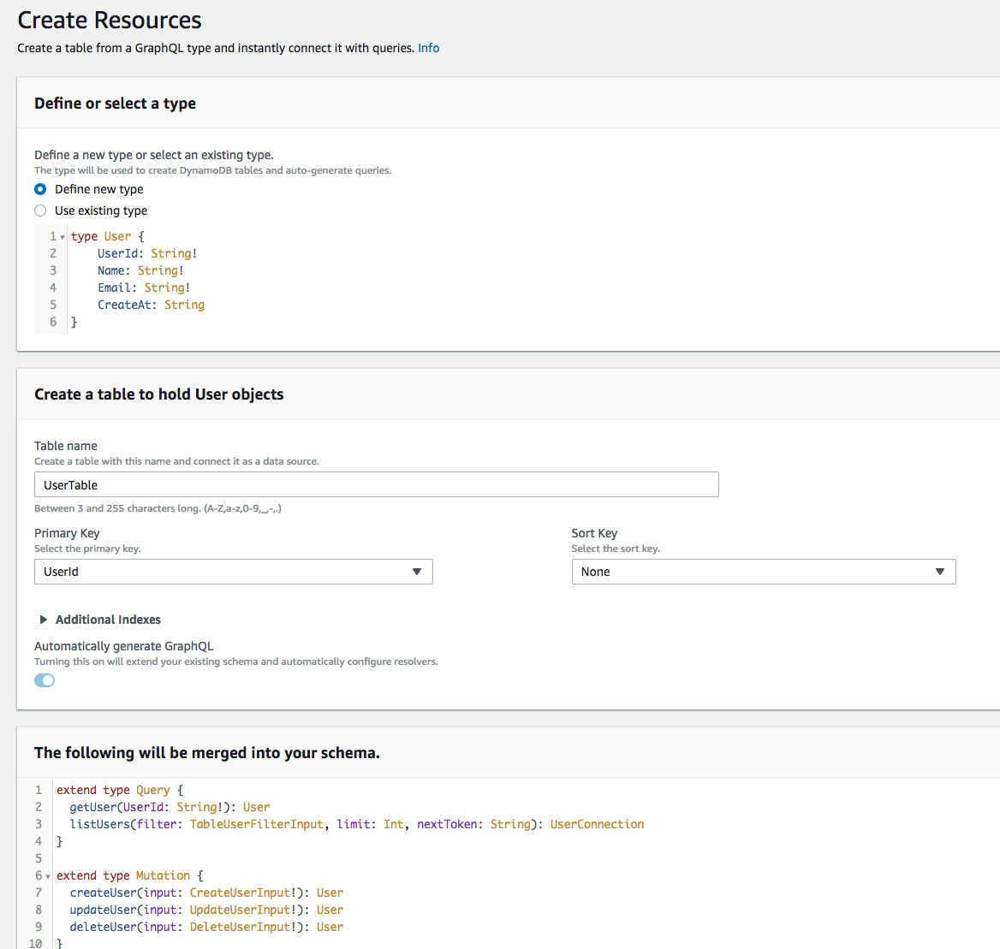
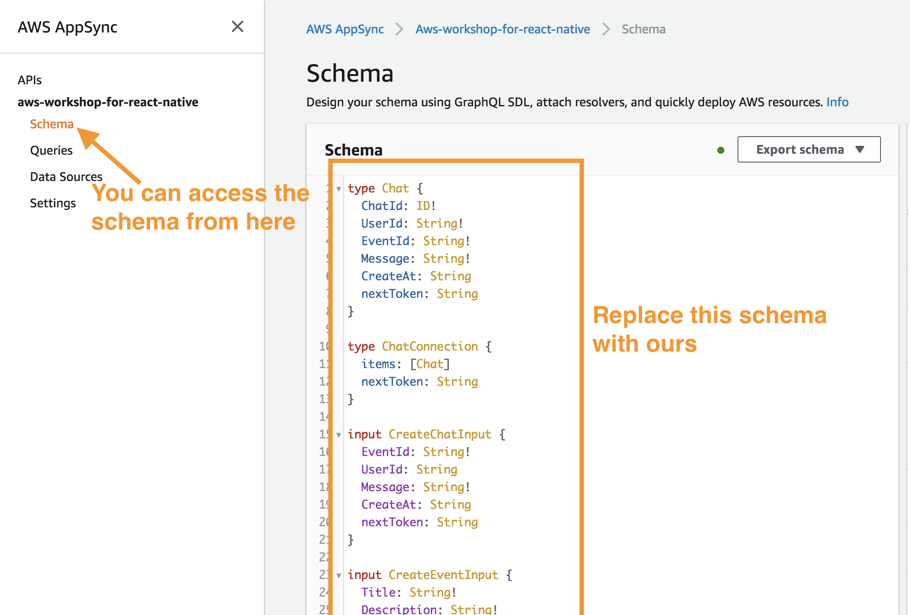
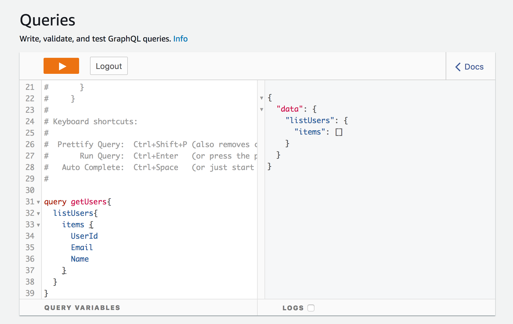

# AppSync
AWS AppSync automatically updates the data in web and mobile applications in real time, and updates data for offline users as soon as they reconnect. AWS AppSync makes it easy to build collaborative mobile and web applications that deliver responsive, collaborative user experiences.

## Table of Contents

* [Create AppSync API](#create-appsync-api)
* [Configure AppSync](#configure-appsync)
* [Setup AppSync data source and schema](#setup-appsync-data-source-and-schema)
* [Configure resolvers](#configure-resolvers)
* [Test your query](#test-your-query)

## Create AppSync API
1. Go to [AWS Console](https://console.aws.amazon.com/appsync/home)

2. Click on the **Create API** button to begin
3. Select **Author from scratch** to start with a blank template
4. Give your API a name, say, **MyChatApp**
5. Click **Create** button to continue
6. Once done, go to the AppSync **Settings** at the left-hand navigation tree


## Configure AppSync
Mobile users will need to be authenticated to use the graphQL endpoint provided by AppSync. Currently, AppSync supports IAM, API Key and Amazon Cognito User Pools. Since this mobile application uses Cognito User Pools, we will be configuring AppSync to use Cognito User Pools for authentication.

1. Under **Authorization type**, select **Amazon Cognito User Pool** to only allow use of AppSync via Cognito
2. Under **User Pool configuration**, select your **AWS Region** where you have your Cognito setup via Mobile Hub CLI.
3. Select the user pool you created in the last lab from the dropdown
4. Under **Default action**, select **ALLOW** to allow authenticated users from Cognito to use your APIs.
5. (Optional) Select **Enable Logs** to see AppSync logs in [CloudWatch](https://console.aws.amazon.com/cloudwatch/home)
6. (Optional) Under **Field resolver log level**, select **All** to see all outlogs from field resolvers
7. (Optional) Under **Create or use an existing role**, select **New role**
8. Click **Save** at the bottom of the page.

## Setup AppSync data source and schema
Now that you have setup your AppSync, let's take a look at our Schema.

AppSync supports multiple data source type: Amazon DynamoDB, Amazon ElasticSearch domain, AWS Lambda and HTTP endpoint. For this application, we will be using 4 DynamoDB tables to model the **Users**, **Events**, **Chats** and **EventUserJoined**.

* **Users**: a list of users who are using the app
* **Events**: a list of events created by the users in the app
* **Chats**: a list of chat messages created in the event by users
* **EvetUserJoined**: a joint table between users and events to indicate who is joining which events

Now that we know what are these tables for, let's create them, together with the AppSync Schema, in the AppSync console.

1. Select **Create Resources** at the top right area of the console.


2. Under **Define or select a type**, select **Define new type** and paste in the following code

```
## Primary Partition Key = UserId, Primary Sort Key = None
## Index = None
type User {
	UserId: String!
	Name: String!
	Email: String!
	CreateAt: String
}
```

3. Under the **Create a table to hold User objects**, make sure the details are right. Note that you do not need to manually go and create your dynamoDB tables manually. Under the section **Create a table to hold User objects**, the **Table name** is the DynamoDB table name to be created in your account. Select the appropriate primary partition key and primary sort key. (See the comment in the code block)
4. Make sure **Automatically generate GraphQL** is selected.

5. (Optional) if you already have an existing tables with the same name, you can add a prefix to your table e.g. for **Chat**, your DynamoDB name can be **wsChatTable**.
6. Now that we are done with **User** model, click **Create** at the bottom of the page.
7. Wait till you see a confirmation message. You should see a message "**Resource creation complete**" (note that it will disappear quickly).

Repeat **Steps 1-6** for the rest of the models below:

**Chat**

```
## Primary Partition Key = ChatId, Primary Sort Key = None
## Add Index = None
type Chat {
	ChatId: ID!
	UserId: String!
	EventId: String!
	Message: String!
	CreateAt: String
	nextToken: String
}
```

**Event**

```
## Primary Partition Key = EventId, Primary Sort Key = None
## Add Index = None
type Event {
	EventId: ID!
	UserId: String!
	Title: String!
	Description: String!
	Color: String!
	DateTimeStart: String!
	CreateAt: String
	nextToken: String
}
```

**EventUserJoined**

Note: in this table, you will need to select `eid` as the *Primary Sort Key*.

```
## Primary Partition Key = uid, Primary Sort Key = eid
## Add Index = None
type EventUserJoined {
	uid: ID!
	eid: String!
}
```


## Update Schema
After you have created the 4 DynamoDB tables, AppSync also generated a default Schema. Replace this default schema with the [this schema](schema.json) as we have updated it for the purpose of this mobile application. Open [schema.json](schema.json), cut/paste into AppSync's Schema input box and click ```Save Schema```.



## Configure resolvers

AWS AppSync use resolvers to translate GraphQL requests into requests for the data source (DynamoDB in this case). Resolvers are written in [Apache Velocity Template](https://velocity.apache.org/engine/2.0/vtl-reference.html).

In this workshop, we have changed a few resolvers in order to:

1. Have a way to *auto-generate* the **ID** for each dynamoDB item
2. Use the ISO-8601 datetime for the `CreateAt` field
3. Use the Cognito **UserId** found in the Cognito Auth session (retrieved using AWS Amplify)

Let's update the resolvers:

1. On the right side of the panel, scroll down until you see "Mutation" section and look for `createUser`. Scroll to the right and click on "UserTable"
2. Under **Configure the request mapping template**, replace the content with the following code:

```
{
  "version": "2017-02-28",
  "operation": "PutItem",
  "key": {
    "UserId": $util.dynamodb.toDynamoDBJson($ctx.args.input.UserId),
  },
 ## add CreateAt
 #set($user = {
    "UserId" : $ctx.args.input.UserId,
    "Name" : $ctx.args.input.Name,
    "Email": $ctx.args.input.Email,
    "CreateAt": $util.time.nowISO8601()
 })

  "attributeValues": $util.dynamodb.toMapValuesJson($user),
  "condition": {
    "expression": "attribute_not_exists(#UserId)",
    "expressionNames": {
      "#UserId": "UserId",
    },
  },
}
```
3. Click **Save Resolver** on the top right.
4. Now, repeat the **Steps 4-6** for the following mutations, leave the rest to default:

**Mutation.createChat**

```
{
  "version": "2017-02-28",
  "operation": "PutItem",
  "key": {
    "ChatId": { "S": "$util.autoId()"},
  },
  #set($chat = {
    "UserId" : $ctx.identity.username,
    "EventId": $ctx.args.input.EventId,
    "Message": $ctx.args.input.Message,
    "CreateAt": $util.time.nowISO8601()
 })
   "attributeValues": $util.dynamodb.toMapValuesJson($chat),
  "condition": {
    "expression": "attribute_not_exists(#ChatId)",
    "expressionNames": {
      "#ChatId": "ChatId",
    },
  },
}
```

**Mutation.createEvent**

```
{
  "version": "2017-02-28",
  "operation": "PutItem",
	"key": {
      "EventId": { "S": "$util.autoId()"}
    },

   #set($event = {
    "UserId" : $ctx.identity.username,
    "Title": $ctx.args.input.Title,
    "Description": $ctx.args.input.Description,
    "Color" : $ctx.args.input.Color,
    "DateTimeStart": $ctx.args.input.DateTimeStart,
    "CreateAt": $util.time.nowISO8601()
 })

  "attributeValues": $util.dynamodb.toMapValuesJson($event),
  "condition": {
    "expression": "attribute_not_exists(#EventId)",
    "expressionNames": {
      "#EventId": "EventId",
    },
  },
}
```

**Mutation.createEventUserJoined**

```
{
  "version": "2017-02-28",
  "operation": "PutItem",
  "key": {
    "uid": $util.dynamodb.toDynamoDBJson($ctx.args.input.uid),
    "eid": $util.dynamodb.toDynamoDBJson($ctx.args.input.eid),
  },
  "attributeValues": $util.dynamodb.toMapValuesJson($ctx.args.input),
  "condition": {
    "expression": "attribute_not_exists(#uid) AND attribute_not_exists(#eid)",
    "expressionNames": {
      "#uid": "uid",
      "#eid": "eid",
    },
  },
}
```

**Mutation.deleteEventUserJoined**

```
{
  "version": "2017-02-28",
  "operation": "DeleteItem",
  "key": {
    "uid": $util.dynamodb.toDynamoDBJson($ctx.args.input.uid),
    "eid": $util.dynamodb.toDynamoDBJson($ctx.args.input.eid),
  },
}
```

Once you are done with Mutations above. Now, let's proceed to the queries.

1. On the right side of the panel, scroll down until you see "Query" section and look for `getChatByEventId`. 
2. Scroll right and click on **Attach** button. 
3. Under **Data source name**, pick **ChatTable** DynamoDB table as the data source to reolve to. 
4. Under **Configure the request mapping template.**, replace the content with the following code:

```
{
  "version": "2017-02-28",
  "operation": "Query",
  "query": {
    "expression": "#EventId = :EventId",
    "expressionNames": {
      "#EventId": "EventId",
    },
    "expressionValues": {
      ":EventId": $util.dynamodb.toDynamoDBJson($ctx.args.EventId),
    },
  },
  "index": "EventId-index"
}
```

5. Under **response mapping template**, replace the content with the following code:
```
## Pass back the result from DynamoDB. **
$util.toJson($ctx.result.items)
```

6. Now, repeat the **Steps 1-3** for the following queries, leave the rest to default:

**Query.getEventUserJoinedByEventId**

Click on Attach, and choose Data Source as "EventUserJoinedTable" from the list.

```
{
    "version" : "2017-02-28",
    "operation" : "Scan",
    "filter" : {
        ## Provide a query expression. **
        "expression": "eid = :eid",
        "expressionValues" : {
            ":eid" : $util.dynamodb.toDynamoDBJson($ctx.args.eid)
        }
    }
}
```
**response mapping template**

```
#**
    Return a flat list of results from a Query or Scan operation.
*#
$util.toJson($ctx.result.items)

```

## Test your query

1. Before you proceed to test your AppSync query, you will need your **ClientId** in the Cognito. Note that it is not your AWS access key. Go to your Cognito UserPool console, under App clients, you can find your respective **ClientId**.

2. Once you have found your ClientId, you can now go to **AppSync Queries**.
3. Click on **Login with User Pools** (Since you are using Cognito UserPool for API authorization, you will need to login as the Cognito user). Use the test user you set up in the previous lab.

4. Key in your **ClientId**, **Username** and **Password**. Note: you can find your **ClientId** in your Cognito console OR `aws-export.js` file. 
5. Click **Login**. At this time, you are prompted to key in the new password for this account.

6. Now you can run your query, paste the following code into the query console:

```
query getUsers{
  listUsers{
    items {
      UserId
      Email
      Name
    }
  }
}
```
7. Click on the "**Play**" button to run your query.
8. We do not have any users in our tables yet. You will see the result on the right side of the panel


Now you have successfully setup AppSync in your AWS environment. Next, you can proceed to [Lab 3](../app) to run your React Native app on your mobile phone.
