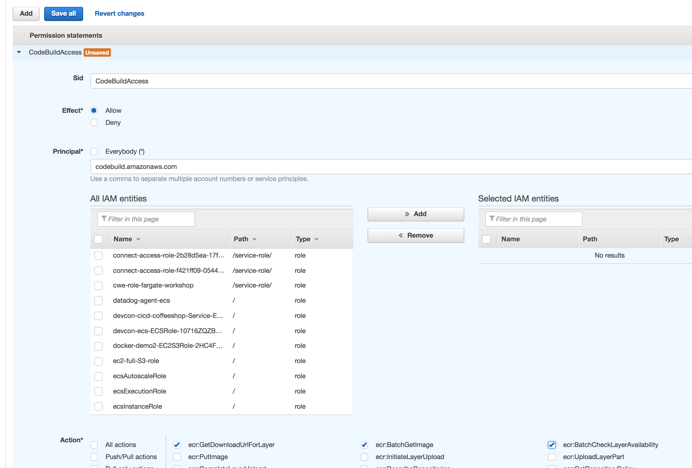
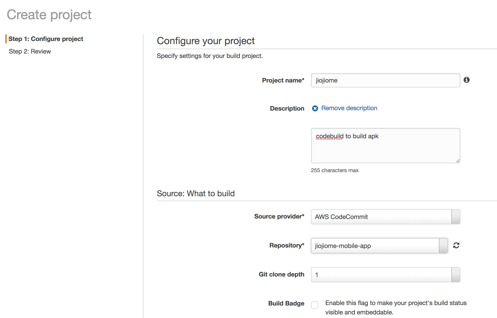
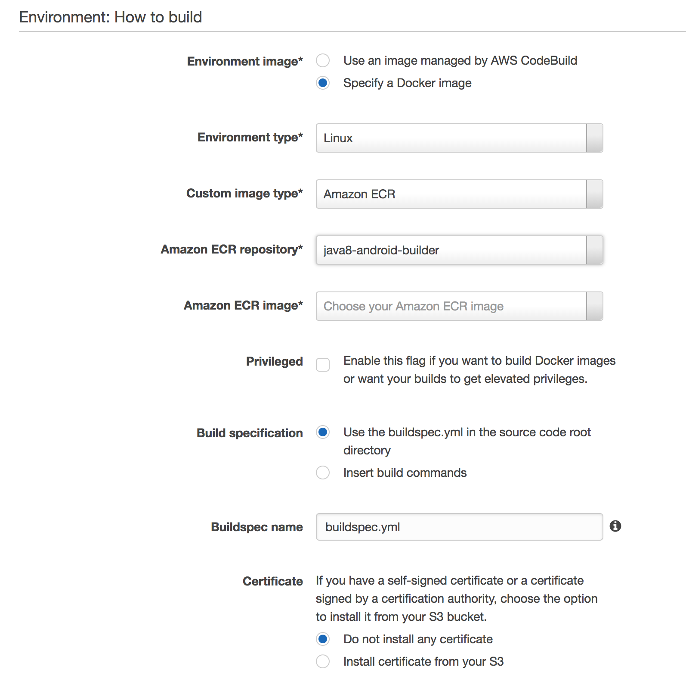

# CI/CD for Mobile

CI/CD for mobile app development has always been challenging due to the different machine configurations, hardware limitation and requirement, and OS environment for building the packages. Typically, for iOS app to be deployed for testing, developers have to spend about half an hour to manually prepare the “archive” IPA and upload them into TestFlight for user testing, and there is no automated ways to test their app in various iPhone and iOS versions. Similar to Android, the setup for CI/CD and builds for different app packages is not consistent & it's a constant painful process to maintain due to the platform updates and new features. With an increasing emphasis on mobile, the pressure to routinely update mobile apps & push new features means there is a need to embrace CI/CD methodologies in mobile development.


## Detach from expo
In your docker container, quite React-Native packager (CRTL-C) and then run this command:

```
exp detach
```
You need to login to your Expo account to detach. 

```
An Expo user account is required to proceed.

? How would you like to authenticate? 
  Make a new Expo account 
❯ Log in with an existing Expo account 
  Cancel 
```
Since we are on AWS Cloud9/docker, we will skip IOS. To proceed with Android build, we need to provide an Android package name, for example ```com.apk.mycoolmobieapp```. This process will update your ```app.json``` file in the current directory.

```
Success. You are now logged in as asean.
[07:20:36] Making sure project is set up correctly...
\[07:20:39] Warning: Not using the Expo fork of react-native. See https://docs.expo.io/.
[07:20:47] Your project looks good!
Validating project manifest...
You have not specified a custom scheme for deep linking. A default value of expa9173199816248ed91b705996074b191 will be used. You can change this later by following the instructions in this guide: https://docs.expo.io/versions/latest/workflow/linking
Skipping iOS because you are not running macOS.
You'll need to specify an Android package name. See: https://docs.expo.io/versions/latest/guides/configuration.html#package
? What would you like your Android package name to be? com.apk.mycoolmobileapp
Moving Android project files...
Downloading Android code...
Updating Android app...
{ buildPhase: 'running shell app modifications' } 'Warning: No config file specified.'
Cleaning up Android...
Android detach is complete!

Writing ExpoKit configuration...
Installing the Expo fork of react-native...
Installing react-native@https://github.com/expo/react-native/archive/sdk-27.0.0.tar.gz using yarn...

Finished detaching your project! Look in the `android` and `ios` directories for the respective native projects. Follow the ExpoKit guide at https://docs.expo.io/versions/latest/guides/expokit.html to get your project running.
```

This will detach your React Native project from expo. You will see a new ```android``` subdirectory created for you.

### Create shell-app-manifest.json

<!-- 1. Using AWS Cloud9 editor, update ```.exp/settings.json```, add " marks around null like so:

```
cat .expo/settings.json 
{
  "hostType": "tunnel",
  "lanType": "ip",
  "dev": true,
  "minify": false,
  "urlRandomness": "null"
  ``` -->

1. Notice that `app.json` now has a new line item:

```
publishManifestPath": "android/app/src/main/assets/shell-app-manifest.json"
```
We need to create this file under `android/app/src/main/assets` directory.

```
# copy  kernel-manifest.json as  shell-app-manifest.json
cd android/app/src/main/assets
cp kernel-manifest.json shell-app-manifest.json
```
## AWS Codebuild

Let's add `buildspec.yml` to the top level directory of our application.

### buildspec.yml
```
version: 0.1
phases:
  build:
    commands:
      - cd android && ./gradlew assembleRelease
artifacts:
  files:
    - android/app/build/outputs/apk/app-prod-release-unsigned.apk

```

## Push your mobile application code to AWS CodeCommit

Add `.gitignore` 

```
# expo
.expo/

# dependencies
/node_modules

# misc
.env.local
.env.development.local
.env.test.local
.env.production.local

npm-debug.log*
yarn-debug.log*
yarn-error.log*

```

Your code directory should look like so now:
```
  ls -a
.  ..  android  App.js  app.json  App.test.js  aws-exports.js  buildspec.yml  .expo  .expo-source  .git  .gitignore  native-base-theme  node_modules  package.json  src  yarn.lock
```

### Create AWS CodeCommit Repository

```
aws codecommit create-repository --repository-name jiojiome-mobile-app
```

Output of the command: 
```
{
    "repositoryMetadata": {
        "repositoryName": "jiojiome-mobile-app", 
        "cloneUrlSsh": "ssh://git-codecommit.ap-southeast-1.amazonaws.com/v1/repos/jiojiome-mobile-app", 
        "lastModifiedDate": 1534061690.066, 
        "repositoryId": "87b338a8-0726-45e3-9ba4-6a73e4f406f1", 
        "cloneUrlHttp": "https://git-codecommit.ap-southeast-1.amazonaws.com/v1/repos/jiojiome-mobile-app", 
        "creationDate": 1534061690.066, 
        "Arn": "arn:aws:codecommit:ap-southeast-1:XXXXXXXXXXXX:jiojiome-mobile-app", 
        "accountId": "XXXXXXXXXXX"
    }
}
```
### Create git credential for AWS CodeCommit
create ssh in iam
- IAM -> User -> Security credential -> SSH keys for AWS CodeCommit -> Upload SSH public key

In AWS Cloud9
 - ssh-keygen  (this creates a new ssh keypair)
 - edit ssh/config 
 ```
 Host git-codecommit.*.amazonaws.com
  User XXXXXXXXXX(from IAM)
  IdentityFile ~/.ssh/id_rsa (key pair created just now)
```
 - chmod 600 ssh/config


### git clone
Execute these commands at the top level of your code directory (`~/environment/rn`): 

```
git init
git commit -m "first commit"
git remote add origin ssh://git-codecommit.ap-southeast-1.amazonaws.com/v1/repos/jiojiome-mobile-app
git push -u origin master
```

Verify that your code is uploaded to AWS CodeCommit using the [CodeCommit console](https://ap-southeast-1.console.aws.amazon.com/codecommit/home?region=ap-southeast-1#/repository/list)


## Build our apk using java8
Take [this Dockerfile](Dockerfile) and build out the java8-android-localbuilder container image. Name the image as `java8-android-localbuilder`.
```
docker build -t java8-android-localbuilder .
```
## Push java8-android-localbuilder to AWS ECR

```
`aws ecr get-login --no-include-email`

aws  ecr create-repository --repository-name java8-android-builder

```
You'll see:


```

{
    "repository": {
        "registryId": "XXXXXXXXXXX", 
        "repositoryName": "java8-android-builder", 
        "repositoryArn": "arn:aws:ecr:ap-southeast-1:XXXXXXXXXXX:repository/java8-android-builder", 
        "createdAt": 1534061289.0, 
        "repositoryUri": "XXXXXXXXXXX.dkr.ecr.ap-southeast-1.amazonaws.com/java8-android-builder"
    }
}
```

### push to ECR
```
docker tag java8-android-localbuilder XXXXXXXXXXX.dkr.ecr.ap-southeast-1.amazonaws.com/java8-android-builder
docker push XXXXXXXXXXX.dkr.ecr.ap-southeast-1.amazonaws.com/java8-android-builder
```
### Assign Codebuild the permission to pull this image from ECR
This is a bonus lab!

CodeBuild->java8-android-builder->Permissions->



## AWS Codebuild

Create Project:



You can specific a S3 bucket to get the build artifact.