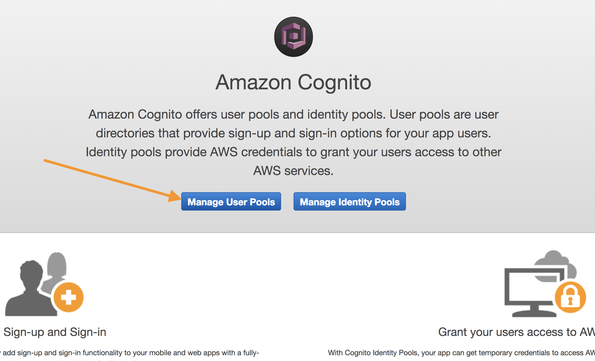
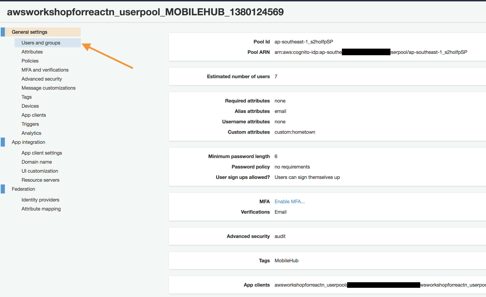
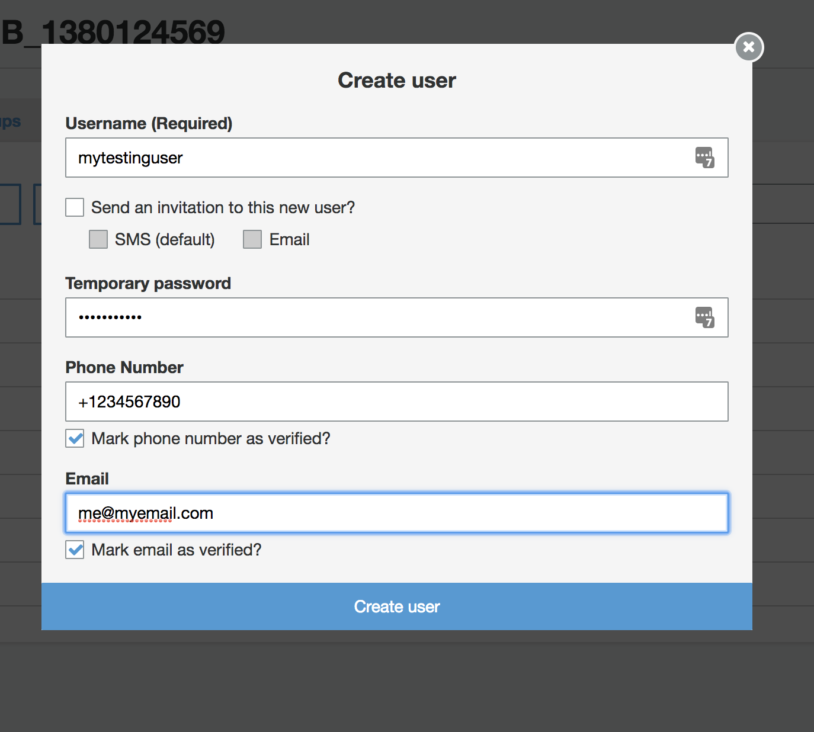

# AWS Mobile

AWS Mobile makes it very easy to configure and integrate your mobile app with AWS services.

**NOTE:**  Execute this lab *INSIDE* the React Native Docker environment.

## Table of Contents:
* [Install AWS Mobile CLI](#install-aws-mobile-cli)
* [Configure AWS Mobile CLI](#configure-aws-mobile-cli)
* [Create AWS mobile project](#create-aws-mobile-project)
* [Add Cognito user pool](#add-cognito-user-pool)
* [Create Cognito user](#create-a-cognito-user)

## Install AWS Mobile CLI

The AWS Mobile CLI, built on top of AWS Mobile Hub, provides a command line interface for frontend JavaScript developers to seamlessly enable and configure AWS services into their apps. With minimal configuration, you can start using all of the functionality provided by the AWS Mobile Hub from your favorite terminal program. We will be using the docker container we built in Lab 0. This container already has the AWS Mobile CLI installed.


## Configure AWS Mobile CLI

Go back to your Cloud9 console, you will need to grant all access to the AWS Mobile CLI in order to access other part of the AWS environments and services. Before you proceed, you need the following requirement:
* AWS IAM credential with "Administrator" permission.
* React Native docker environment launched. (using docker run ... command in [Lab 0](../setup/))

Run this command inside the react-native docker environment:
```
awsmobile configure
```

You should see:
```
configure aws
? accessKeyId:  AKIAXXXXXXXXXXXXXXX
? secretAccessKey:  jxxxxxxxxxxxxxxxxxxxxxxxxxxxxxxxxxxxx
? region:  ap-southeast-1
```

This video will walk you through the process of creating an Adminstrator IAM user and `awsmobile configure` ([https://www.youtube.com/watch?v=MpugaNKtw3k](https://www.youtube.com/watch?v=MpugaNKtw3k))

## Create AWS Mobile project

Run this command inside the react-native docker environment. 

**IMPORTANT**: Ensure you are in the ```/code``` directory.
```
awsmobile init
```

Follow the commands in the following, take note that the `project's sourced directory` is ``.`` 
```
Please tell us about your project:
? Where is your project's source directory:  .
? Where is your project's distribution directory that stores build artifacts:  dist
? What is your project's build command:  npm run-script build
? What is your project's start command for local test run:  npm run-script start
? What awsmobile project name would you like to use:  jiojiome
```

You should see this output:
```
Success! your project is now initialized with awsmobilejs

   awsmobilejs/.awsmobile
     is the workspace of awsmobile-cli, please do not modify its contents

   awsmobilejs/#current-backend-info
     contains information of the backend awsmobile project from the last
     synchronization with the cloud

   awsmobilejs/backend
     is where you develop the codebase of the backend awsmobile project

   awsmobile console
     opens the web console of the backend awsmobile project

   awsmobile run
     pushes the latest development of the backend awsmobile project to the cloud,
     and runs the frontend application locally

   awsmobile publish
     pushes the latest development of the backend awsmobile project to the cloud,
     and publishes the frontend application to aws S3 for hosting

Happy coding with awsmobile!
```

## Add Cognito user pool

We need a way to authenticate the users of our app. We will use Amazon Cognito as our user directory. Setting it up is as simple as running the command below inside the react-native docker environment.
```
awsmobile user-signin enable --prompt
```

Choose "Go to advanced settings" using the down arrow. You should see something as follow. Choose "Cognito UserPools (currently disabled)" and press "Enter".
```
❯ Go to advanced settings
❯ Cognito UserPools (currently disabled)
```

Use the spacebar to unselect Email. Use down arrow to go to Username and spacebar again to select it.
```
? How are users going to login
❯◯ Email
 ◉ Username
 ◯ Phone number (required for multifactor authentication)
```

Set password minimum length:
```
? Password minimum length (number of characters) (8)
```

Set password complexity:
```
? Password character requirements
 ◉ uppercase
 ◉ lowercase
 ◉ numbers
❯◉ special characters
```

You should see this:
```
? Sign-in is currently disabled, what do you want to do next Go to advanced settings
? Which sign-in method you want to configure Cognito UserPools (currently disabled)
? How are users going to login Username
? Password minimum length (number of characters) 8
? Password character requirements uppercase, lowercase, numbers, special characters
```

We will now push the settings to AWS Mobile Hub. This will create a Cognito User Pool.

Run this command inside the react-native docker environment:
```
awsmobile push
```

Go to [Cognito Console](https://ap-southeast-1.console.aws.amazon.com/cognito/users?region=ap-southeast-1), select the User Pool that is created for you and you can see the Cognito user pool. The name is of the format `<your mobilehub project name>_userpool_MOBILEHUB_<random number>`. This Cognito user pool will be used to authenticate the access to the AWS AppSync endpoint.

## Create a Cognito user
1. Let's set up a user for testing. Navigate to your [Cognito Console](https://console.aws.amazon.com/cognito/home)

2. Select **Manage Identity Pools**


3. Select the **Cognito User Pool** that was generated by Mobile Hub and click on Users and groups.


4. Click **Create User** to begin

5. Fill up the form to create your first user in Cognito for testing purpose in the next lab. At this time, you do not need a real phone number and email. Refer to the screenshot below for more information and click **Create User** to proceed.


6. Check that your newly created user is in the users table with the status column set to **FORCE_CHANGE_PASSWORD** and enabled column set to **ENABLED**

You have successfully configured the AWS Mobile for your mobile app. Next, you can proceed to [Lab 2](../appsync) to work on setting the AWS AppSync.